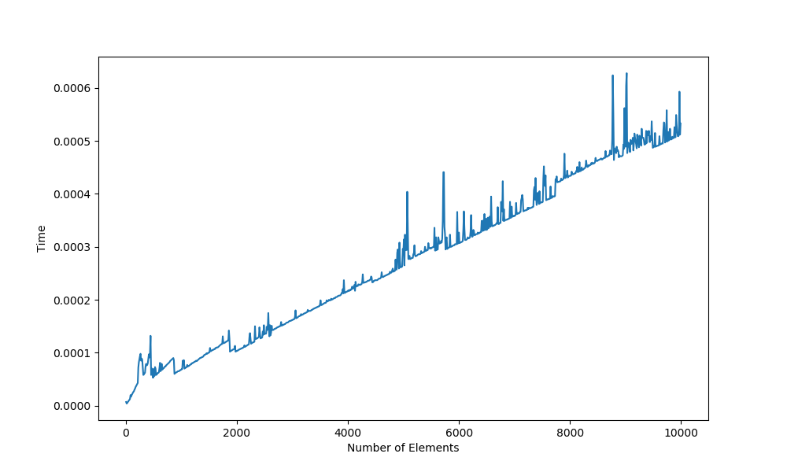

# A simple binary heap library (and testing tools)
This project is a template for a simple array-implementation of binary 
heaps in the C-programming language.

This template contains all the code needed to test your implementation of 
binary heaps in both correctness and efficiency terms. 
Your are exclusively required to code the type `binheap_type` 
in the file [binheap.h](include/binheap.h) and all the functions 
dealing it in the file [binheap.c](src/binheap.c). The meaning of the 
function parameters and the semantics of the functions themselves are detailed 
in [binheap.h](include/binheap.h).
Once this has been done, a set of tests can be produced as described below.

You can generate the Makefile by using [cmake](https://cmake.org/) as follows:
```bash
cmake -G "Unix Makefiles" CMakeLists.txt
```
Afterwards you can compile the code by executing `make`. This produces a set 
of programs, named `test_delete_min`, `test_insert`, etc., which can be 
executed in POSIX systems siply by writing `./` and the name of the program 
in the terminal. 
For instance, in order to execute `test_delete_min`, use the following command:
```bash
./test_delete_min
Setting up test sets...done

Keep removing the minimum
n	On Heaps	On Arrays
0	0.000004	0.000005
409	0.000001	0.052824
818	0.000001	0.204115
1227	0.000002	0.470132
1636	0.000001	0.804782
2045	0.000001	1.270438
2454	0.000001	1.825179
2863	0.000001	2.499937
3272	0.000001	3.238163
3681	0.000001	4.117790
4090	0.000001	5.064005
```

## Installing the library

In order to install the library, you can set the install directory `<BINHEAP_INSTALL_DIR>` by executing:
```bash
cmake -G "Unix Makefiles" -DCMAKE_INSTALL_PREFIX=<BINHEAP_INSTALL_DIR> CMakeLists.txt
```
If you don't do it, the library and its headers will be installed in `/usr/local/`.
After that simply write:
```bash
make install
```

#  Report Binary Heaps: Homework (17/3/2020)

## Exercise 1  

* Implement the array-based representation of binary heap together with the functions HEAP MIN, REMOVE MIN, HEAPIFY, BUILD HEAP, DECREASE KEY, and INSERT VALUE.

**Solution:** Array- based representation of binary heap has been already implemented in lecture 6,  lecture 7 and  lecture 8.  All the implementations can be found in `binheap.c`.

Firstly, representation of binary heaps are defined and this struct includes the following properties:

`void *A`: This is the array used to store heap nodes
`num_of_elem`: This is the number of nodes in the heap
`max_size`: This is the maximum number of size
`key_size`: Size of the key type
`leq`: This is the heap total order which is user defined (total_order_type)
`max_order_value`: This is the maximum value stored in the heap

Also common heap operations are implemented as well as useful ones such as heapify, build_heap, insert, find_max and extract.

## Exercise 2
* Implement an iterative version of HEAPIFY.

**Solution:** Again iterative version of heapify has been implemented in lectures 6,7 and 8. Function takes two arguments `binheap_type *H` and `node`. Destination node is containing the minimum among the nodes its children.  

Idea is correcting a single violation of the heap property in a sub-trees root, of course by making necessary comparisons (total_order is used, good candidates are chosen by checking right and left children) and swaps.

## Exercise 3
* Test the implementation on a set of instances of the problem and evaluate the execution time.

**Solution:**  In the folder tests, `performance_test.c` file has been written. It is a simple code which measures the time to insert random value to heap and produce a file named `output.txt`. One can easily compile the `performance_test.c`  by using following command `gcc performance_test.c -I /usr/local/lib ../libbinheap.so -o insert_test.o`. 




Above you can find the the asymptotic complexity of the `insert_value` function. 

## Exercise 4
* (Ex. 6.1-7) Show that, with the array representation, the leaves of a binary heap containing n nodes are indexed by $\lfloor{n}/{2}\rfloor + 1, \lfloor{n}/{2}\rfloor + 2, . . . n$.

**Solution:** Consider the node indexed by $\lfloor{n}/{2}\rfloor +1$ and I want to show that index $\lfloor{n}/{2}\rfloor +1$ is a leaf which can be proved if we can show the index of the left child is larger than the number of elements in the heap.

$$
LEFT(\lfloor{n}/{2}\rfloor +1) = 2(\lfloor{n}/{2}\rfloor +1) \\
> 2(n/2-1) + 2 \\
= n-2+2 \\
= n \\
$$

Since the index of the left child is larger than the number of elements in  the heap we can say that the node is leaf (since it doesn’t have children). Same procedure can be applied for larger indices.

## Exercise 5:  
* (Ex. 6.2-6) Show that the worst-case running time of `HEAPIFY` on a binary heap of size n is $\Omega(logn)$. (Hint: For a heap with n nodes, give node values that cause `HEAPIFY` to be called recursively at every node on a simple path from the root down to a leaf.)

**Solution:** Assume there is the smallest value at the root (worst case scenario for max heap but one can easily adapt this idea to min heap). Since it is the smallest value, it has to be swapped through each level  of the heap until it became a leaf. In this case , heapify will be called h times (height of tree) since the height of heap is logn, it has worst-case time $\Omega(logn)$.

## Exercise 6:  
* (Ex. 6.3-3) Show that there are at most $\lceil{n}/{2^{h+1}}\rceil$ nodes of height $h$ in any $n$-element binary heap.

**Solution:** We know that from (Exercise 4) leaves of a heap are nodes indexed by $\lfloor{n}/{2}\rfloor + 1, \lfloor{n}/{2}\rfloor + 2, . . . n$. Those elements are the second half of the heap (if n is odd also middle element). Hence number of leaves in a heap is $\lceil{n}/{2}\rceil$. 
Let’s prove this by induction:

* Assume that $n_h$ is the number of nodes at height $h$. The upper bound holds for the base since $n_0 = \lceil{n}/2\rceil$ which is exactly the number of leaves in a heap of size n.
* Now let’s check it for $h-1$. Note that if $n_{h-1}$ is even each node at height $h$ has exactly two children, which implies that $n_h = n_{h-1}/2 = \lfloor{n_{h-1}}/{2}\rfloor$. If $n_{h-1}$ is odd, one node at height h has one child and remaining has two children, which implies that $n_h =\lfloor{n_{h-1}}/{2}\rfloor +1 = \lceil{n_{h-1}}/{2}\rceil$. So we have:

$$
n_h = \lceil{n_{h-1}}/{2}\rceil \\
\leq \lceil 1/2.\lceil{n}/{2^{(h-1)+1}}\rceil \rceil \\
=\lceil1/2.\lceil n/2^h \rceil \rceil \\
=\lceil{n}/{2^{h+1}}\rceil \\
$$
which implies that it holds for h.
